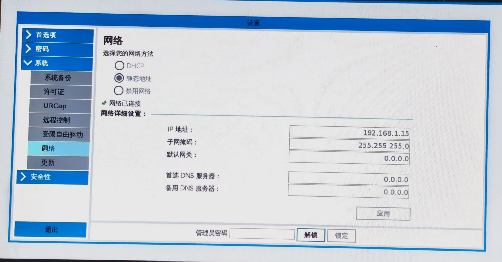

## demo 演示
[pika 遥操 UR 机械臂 demo 演示](https://www.bilibili.com/video/BV1TUu1zSErr/?spm_id_from=333.337.search-card.all.click&vd_source=7709cbc7772ffadc8d4582d386d6341c)


## 从零入门 Pika 遥操 （UR篇）

建议开始之前先阅读[Pika 遥操任意机械臂的方法]

知道了原理之后，下面就开始手把手码一个遥操程序，为了快速实现遥操功能，此次我们使用的有：

- pika sdk：它能快速获取 pika sense 的全部数据以及达到快速上手控制gripper。
- 各种转换工具：如将xyzrpy转换成4x4齐次变换矩阵、将xyz以及四元数转换成4x4齐次变换矩阵、将RPY角度(绕X/Y/Z轴旋转)转换为旋转矢量等。
- UR机械臂控制接口：该控制接口主要是使用ur-rtde库，通过下发目标位姿（xyz以及旋转矢量）、速度、加速度、每次控制的间隔周期（频率）、前瞻时间以及比例增益来进行实时控制。


## 环境配置

1、克隆代码

```bash
git clone --recurse-submodules https://github.com/RoboPPN/pika_remote_ur.git
```

2、安装依赖

```bash
cd pika_remote_ur/pika_sdk

pip3 install -r requirements.txt  

pip3 install -e .

pip3 install ur-rtde
```

## UR 控制接口

先从控制接口说起，遥操控制首先得写好控制接口，比如像 UR 的原始控制接口输入的是 xyz以及旋转矢量，那我们在遥操代码下发的一般是 xyzrpy，这就需要做一个转换，可以在控制接口做转换，也可以在遥操主程序做转换。在这里我是在遥操主程序中做的转换，下面是 UR 机械臂的控制接口，代码文件位于pika_remote_ur/ur_control.py：

```python
import rtde_control
import rtde_receive

class URCONTROL:
    def __init__(self,robot_ip):
        # Connect to the robot
        self.rtde_c = rtde_control.RTDEControlInterface(robot_ip)
        self.rtde_r = rtde_receive.RTDEReceiveInterface(robot_ip)
        if not self.rtde_c.isConnected():
            print("Failed to connect to the robot control interface.")
            return
        if not self.rtde_r.isConnected():
            print("Failed to connect to the robot receive interface.")
            return
        print("Connected to the robot.")
            
        # Define servoL parameters
        self.speed = 0.15  # m/s
        self.acceleration = 0.1  # m/s^2
        self.dt = 1.0/50  # dt for 500Hz, or 1.0/125 for 125Hz
        self.lookahead_time = 0.1  # s
        self.gain = 300  # proportional gain
        
    def sevol_l(self, target_pose):
        self.rtde_c.servoL(target_pose, self.speed, self.acceleration, self.dt, self.lookahead_time, self.gain)
        
    def get_tcp_pose(self):
        return self.rtde_r.getActualTCPPose()
    
    def disconnect(self):
        if self.rtde_c:
            self.rtde_c.disconnect()
        if self.rtde_r:
            self.rtde_r.disconnect()
        print("已断开UR连接")

# example
# if __name__ == "__main__":
#     ur = URCONTROL("192.168.1.15")
#     target_pose = [0.437, -0.1, 0.846, -0.11019068574221307, 1.59479642933605, 0.07061926626169934]
    
#     ur.sevol_l(target_pose)
```

代码定义了一个名为 URCONTROL 的 Python 类，用于与 UR 机器人进行通信和控制。该类封装了 rtde_control 和 rtde_receive 库的功能，提供了 连接机器人、断开连接、发送 servoL 指令以及获取 TCP 姿态的方法。


## 遥操核心代码

遥操代码位于pika_remote_ur/teleop_ur.py

从《pika摇操任意机械臂的方法》中得知，遥操的原理，总的来说就是四步：

1、获取 6d Pose 数据

2、坐标系对齐

3、增量式控制

4、将 6d Pose 数据映射到机械臂

### 获取位姿数据

代码如下：

```bash
# 获取tracker设备的位姿数据
def get_tracker_pose(self):
    logger.info(f"开始获取{self.target_device}设备的位姿数据...")
    while True:
        # 获取位姿数据
        pose = self.sense.get_pose(self.target_device)
        if pose:
            # 提取位置和旋转数据用于进一步处理
            position = pose.position  # [x, y, z]
            rotation = self.tools.quaternion_to_rpy(pose.rotation[0],pose.rotation[1],pose.rotation[2],pose.rotation[3])  # [x, y, z， w] 四元数

            self.x,self.y,self.z,   self.roll, self.pitch, self.yaw = self.adjustment(position[0],position[1],position[2],
                                                                                      rotation[0],rotation[1],rotation[2])                                                                           
        else:

            logger.warning(f"未能获取{self.target_device}的位姿数据，等待下一次尝试...")

        time.sleep(0.02)  # 每0.02秒获取一次（50Hz）
```

该代码每0.02秒获取名称为“T20”的tracker的位姿信息，名称有两种类型，一种是以 WM 开头的，一种是以 T 开头的。使用有线连接tracker和电脑的话，第一个接上的tracker设备名为 T20，第二个就是 T21，以此类推；使用无线方式连接的，第一个接上电脑的设备名为 WM0，第二个为 WM1，以此类推。

获取到的位姿数据还需对其进行处理，使用 adjustment 函数对其坐标进行调整，将其调整到 UR 机械臂末端坐标系相同，使其两者对其。


### 坐标系对齐

代码如下：

```python
# 调整矩阵函数
def adjustment(self,x,y,z,Rx,Ry,Rz):
    transform = self.tools.xyzrpy2Mat(x,y,z,   Rx, Ry, Rz)

    r_adj = self.tools.xyzrpy2Mat(self.pika_to_arm[0],self.pika_to_arm[1],self.pika_to_arm[2],
                                  self.pika_to_arm[3],self.pika_to_arm[4],self.pika_to_arm[5],)   # 调整坐标轴方向  pika--->机械臂末端

    transform = np.dot(transform, r_adj)

    x_,y_,z_,Rx_,Ry_,Rz_ = self.tools.mat2xyzrpy(transform)

    return x_,y_,z_,Rx_,Ry_,Rz_
```

该函数的功能是坐标变换调整：

1. 将输入的位姿(x,y,z,Rx,Ry,Rz)转换为变换矩阵
2. 获取从pika坐标系到机械臂末端坐标系的调整矩阵
3. 通过矩阵乘法将两个变换合并
4. 将最终的变换矩阵转换回位姿参数并返回

这样通过该函数就能获取到转换好的位姿信息。


### 增量式控制

在遥操作中，Pika sense 给出的位姿是绝对位姿，但是我们不希望机械臂直接跳到这个绝对位姿。相反，我们希望机械臂能够跟随操作者从当前位置开始的相对运动。简单来说，就是将操作设备的绝对位姿变化，转换为机械臂需要执行的相对位姿指令。

代码如下：

```python
# 增量式控制
def calc_pose_incre(self,base_pose, pose_data):
    begin_matrix = self.tools.xyzrpy2Mat(base_pose[0], base_pose[1], base_pose[2],
                                                base_pose[3], base_pose[4], base_pose[5])
    zero_matrix = self.tools.xyzrpy2Mat(self.initial_pose_rpy[0],self.initial_pose_rpy[1],self.initial_pose_rpy[2],
                                        self.initial_pose_rpy[3],self.initial_pose_rpy[4],self.initial_pose_rpy[5])
    end_matrix = self.tools.xyzrpy2Mat(pose_data[0], pose_data[1], pose_data[2],
                                            pose_data[3], pose_data[4], pose_data[5])
    result_matrix = np.dot(zero_matrix, np.dot(np.linalg.inv(begin_matrix), end_matrix))
    xyzrpy = self.tools.mat2xyzrpy(result_matrix)
    return xyzrpy   
```

这个函数正是利用了变换矩阵的运算法则来实现增量控制。我们来逐步分解代码：

输入参数:

base_pose: 这是遥操作开始时的基准位姿。当遥操作触发时，系统会记录下当时操作设备的位姿，并将其存为 self.base_pose。这个位姿是计算后续所有增量的“起点”或“参考零点”。

pose_data: 这是当前时刻从操作设备（Pika sense）实时接收到的位姿数据。

矩阵转换: 函数首先将三个关键的位姿（用 [x, y, z, roll, pitch, yaw] 格式表示）转换成4x4的齐次变换矩阵。这通常由 tools.xyzrpy2Mat 函数完成。

begin_matrix: 由 base_pose 转换而来，代表遥操作开始时操作设备的位姿矩阵。我们称之为 T_begin。

zero_matrix: 由 self.initial_pose_rpy 转换而来，代表遥操作开始时机械臂末端的位姿矩阵。这是机械臂运动的“起始点”。我们称之为 T_zero。

end_matrix: 由 pose_data 转换而来，代表当前时刻操作设备的位姿矩阵。我们称之为 T_end。

核心计算: 这是最关键的一行代码：

```python
result_matrix = np.dot(zero_matrix, np.dot(np.linalg.inv(begin_matrix), end_matrix))
```

我们用矩阵乘法来分析它：

所以，result_matrix 最终得到的是机械臂在世界坐标系下，当前应该达到的目标位姿矩阵。

公式表示: Result = T_zero * (T_begin)⁻¹ * T_end

np.linalg.inv(begin_matrix): 计算 begin_matrix 的逆矩阵，即 (T_begin)⁻¹。在机器人学中，一个变换矩阵的逆矩阵表示其反向变换。

np.dot(np.linalg.inv(begin_matrix), end_matrix): 这一步计算的是 (T_begin)⁻¹ * T_end。这个运算的物理意义是：从 begin 坐标系变换到 end 坐标系所需要进行的变换。换句话说，它精确地描述了从遥操作开始到现在，操作设备所产生的相对位姿变化（增量）。我们称这个增量为 ΔT。

np.dot(zero_matrix, ...): 这一步计算的是 T_zero * ΔT。它的物理意义是：将刚刚计算出的相对位姿变化 (ΔT) 应用到机械臂的初始位姿 (T_zero) 上。

结果转换与返回:

xyzrpy = tools.mat2xyzrpy(result_matrix): 将计算出的4x4目标位姿矩阵 result_matrix 转换回机器人控制器能理解的 [x, y, z, roll, pitch, yaw] 格式。

return xyzrpy: 返回这个计算出的目标位姿。


### 遥操作触发

其实触发遥操作的方式有很多种：

有语音触发，操作者通过一个唤醒词就能触发；

有服务器请求式触发，通过请求触发操作；

其实上面两种都不太方便操作，语音触发的话就是需要额外的语音输入模块，还有唤醒词识别不准的问题，有时候你要说很多次才能触发成功一次，遥操还没开始，口就已经先干了；服务器请求的话，需要控制电脑发送请求，2个人配合的话还好，只有一个人时就手忙脚乱了。

而我们用的方法就是通过检测 pika sense 的状态转换来进行触发，操作者只需手持 pika sense，然后通过快速双击两下使状态进行反转，从而达到触发遥操作的作用，代码如下：

```python
# 遥操作触发
def handle_trigger(self):
    current_value = self.sense.get_command_state()

    if self.last_value is None:
        self.last_value = current_value
    if current_value != self.last_value: # 检测到状态改变
        self.bool_trigger = not self.bool_trigger # 反转 bool_trigger
        self.last_value =  current_value # 更新 last_value
        # 根据新的 bool_trigger 值执行相应的操作
        if self.bool_trigger :
            self.base_pose = [self.x, self.y, self.z, self.roll, self.pitch, self.yaw]
            self.flag = True
            print("开始遥操作")

        elif not self.bool_trigger :
            self.flag = False

            #-------------------------------------------------方案一：遥操结束机械臂停止在当前位姿，下次遥操开始继续从当前位姿开始---------------------------------------------------

            self.initial_pose_rotvec = self.ur_control.get_tcp_pose()

            temp_rotvec = [self.initial_pose_rotvec[3], self.initial_pose_rotvec[4], self.initial_pose_rotvec[5]]

            # 将旋转向量转换成欧拉角
            roll, pitch, yaw = self.tools.rotvec_to_rpy(temp_rotvec)

            self.initial_pose_rpy = self.initial_pose_rotvec[:]
            self.initial_pose_rpy[3] = roll
            self.initial_pose_rpy[4] = pitch
            self.initial_pose_rpy[5] = yaw

            self.base_pose = self.initial_pose_rpy # 想要的目标姿态数据
            print("停止遥操")

            #-------------------------------------------------方案二：遥操结束机械臂回到初始位姿，下次遥操开始从初始位姿开始---------------------------------------------------

            # # 获取当前机械臂的位姿
            # current_pose = self.ur_control.get_tcp_pose()

            # # 定义插值步数
            # num_steps = 100  # 可以根据需要调整步数，步数越多，过渡越平滑

            # for i in range(1, num_steps + 1):
            #     # 计算当前插值点位姿
            #     # 这里假设 initial_pose_rotvec 和 current_pose 都是 [x, y, z, Rx, Ry, Rz] 格式
            #     interpolated_pose = [
            #         current_pose[j] + (self.initial_pose_rotvec[j] - current_pose[j]) * i / num_steps
            #         for j in range(6)
            #     ]
            #     self.ur_control.sevol_l(interpolated_pose)
            #     time.sleep(0.01)  # 每次插值之间稍作延时，控制速度

            # # 确保最终到达初始位置
            # self.ur_control.sevol_l(self.initial_pose_rotvec)


            # self.base_pose = [self.x, self.y, self.z, self.roll, self.pitch, self.yaw]
            # print("停止遥操")
```

该代码通过 self.sense.get_command_state() 一直返回 pika sense 当前的状态，它会一直输出0或1两种状态。当程序开始时，默认 bool_trigger 是 False，当发生第一次反转时，bool_trigger 置为 True，此时将 tracker 的 pose 设置为零点，将 self.flag 置为 True，将控制数据下发至机械臂对其进行控制；想要结束遥操，同样也是双击两下使状态进行反转，此时机械臂会在当前位姿停止，下次状态反转开始遥操时就从当前位姿开始遥操。上述是方案一结束遥操机械臂的控制方式，方案二是遥操结束机械臂回到初始位姿，下次遥操开始从初始位姿开始。想要哪种方式的遥操自己根据情况选择。

### 将pika位姿数据映射给机械臂

这部分代码如下：

```python
def start(self):
    self.tracker_thread.start() # 启动线程        
    # 主线程继续执行其他任务
    while self.running:
        self.handle_trigger()
        self.control_gripper()
        current_pose = [self.x, self.y, self.z, self.roll, self.pitch, self.yaw]
        increment_pose = self.calc_pose_incre(self.base_pose,current_pose)

        finally_pose  = self.tools.rpy_to_rotvec(increment_pose[3], increment_pose[4], increment_pose[5])

        increment_pose[3:6] = finally_pose

        #下发pose至机械臂
        if self.flag:
            self.ur_control.sevol_l(increment_pose)

        time.sleep(0.02) # 50Hz更新
```

这部分代码就是用增量式算出来的 increment_pose ，将其rpy旋转转换成旋转矢量再下发给机械臂（UR机械臂是接收xyz和旋转矢量来进行控制）。当 self.flag 为 True 时，才将控制数据下发给机械臂。


## 实操

遥操代码内容在：pika_remote_ur/teleop_ur.py 中。

1、将 UR 机械臂通电并对关节电机进行使能启动，如机械臂末端装有夹爪等执行器，需要填入相应的负载。

2、在平板上对机械臂IP进行配置。



3、对工具坐标系进行设置。


这里的末端坐标系一定要设置成 z 轴朝前，x 轴朝下，y 轴朝左。因为在代码中我们将pika的坐标系绕y轴逆时针转动了90°，那么此时pika的坐标系为：z轴朝前，x轴朝下，y轴朝左。所以这里机械臂末端（工具）坐标系也要与此对应上，否则控制会一团糟。

4、首次开始使用应将速度调至20-30%，然后开启机械臂的远程控制。

5、使用USB线将tracker与电脑连接，对 tracker 与基站进行校准。

进入到~/pika_ros/scripts路径下，运行：

```bash
bash calibration.bash 
```

待定位校准好后，关闭程序。

6、使用 USB3.0 线将 pika sense 、pika gripper与电脑相连，注意：先插入sense，此时sense的端口应为/dev/ttyUSB0，然后插入gripper（gripper需要24v直流供电），此时gripper端口应为/dev/ttyUSB1 。

7、运行代码：

```bash
cd pika_remote_ur

python3 teleop_ur.py
```

终端会输出很多 log，其中最多的是：

```bash
teleop_ur - WARNING - 未能获取T20的位姿数据，等待下一次尝试...
```

直到上面的log不在输出，而是输出：

```bash
pika.vive_tracker - INFO - 检测到新设备更新: T20
```

则可以开始双击开始遥操作了。


